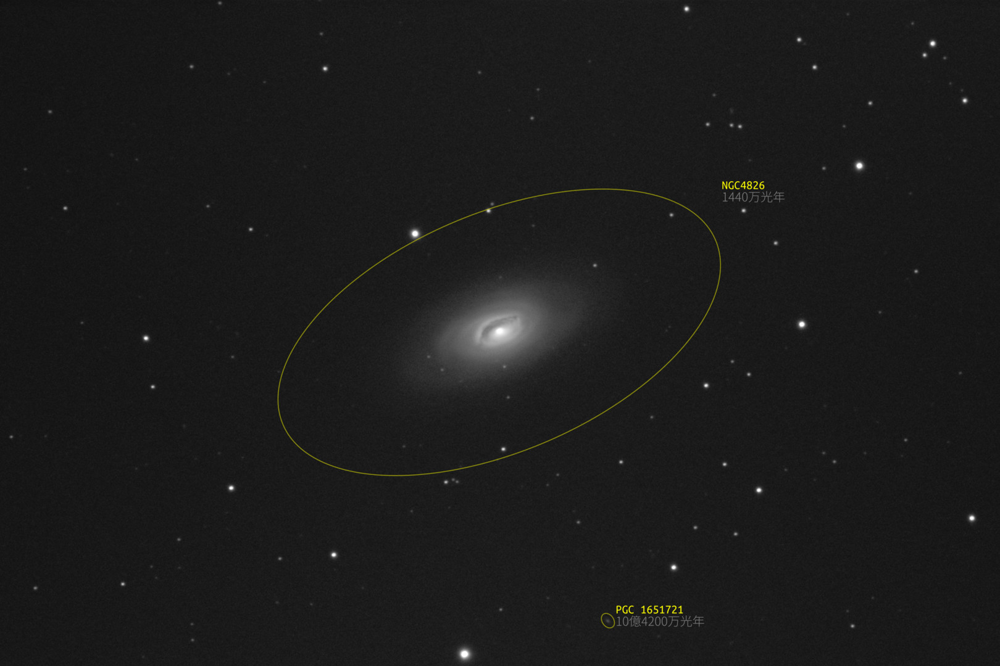
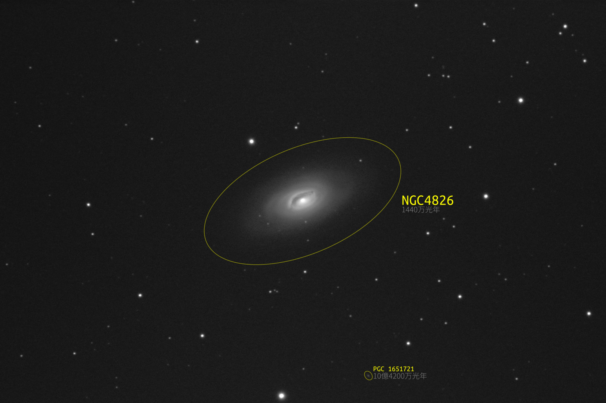

# Galaxy Annotator v0.9.2

## 概要

天体写真上の銀河のアノテーションを行うツールです。以下を入力するとアノテーション付きの SVG 画像ファイルを出力します。

- 銀河データファイル(JSON形式、後述)
- スタイル設定ファイル(JSON形式、後述)
- Astrometry.net の出力した `wcs.fits` (FITS形式)
- Astrometry.net に入力した画像ファイル

最終出力は SVG 編集ツール(Inkscape等)で調整できます。

銀河データファイルは手で書いてもいいですが、同梱のツールで HyperLeda から取得できます。

## 動作環境

- Python 3.2 以降
- astropy
- svgwrite

Anaconda 環境の場合 astropy は標準で入っています。svgwrite は 'conda install -c conda-forge svgwrite' でインストールしてください。

以下、コマンドライン操作についての記述は Linux 環境を例にしています。Windows, macOS 環境での操作については適宣読み替えてください。

## アノテーション付き画像の生成

`galaxy-annotator.py` を使用します。

例:
```
python galaxy-annotator.py sample-galaxies.json sample-style.json test-data/test-wcs.fits test-data/test-in.jpg out.svg
```

- `sample-galaxies.json`: 銀河データファイルです。
- `sample-style.json`: スタイル設定ファイルです。
- `test-data/test-wcs.fits`: `test-data/test-in.jpg` を Astrometry.net でプレートソルブした際に生成された `wcs.fits` です。
- `test-data/test-in.jpg`: Astrometry.net に入力した元画像ファイルです。
- `out.svg`: 出力先のSVGファイルです。

Web ではなくローカルにインストールした astrometry.net の `solve-field` コマンドでプレートソルブした場合は、拡張子 `.wcs` の出力ファイル(中身はFITS形式です)を第3引数に指定してください。

出力先のSVGファイルが既に存在する場合は以下のような上書き警告のプロンプトを表示します。

```
output file 'out.svg' exists. overwrite? > 
```

上書きする場合は `yes` をキャンセルする場合は `no` を入力してください。なお、コマンドラインで `-f` オプションを指定すると無警告で上書きします。

マーカーは銀河を囲む楕円形として描画されます。銀河の名前と説明文がその近くに描画されます。マーカーの色、名前や説明文のフォントや配置などはスタイル設定ファイルで指定できます(後述)。

出力されるSVG画像には元の画像(第4引数でしていしたもの)が埋め込まれます。SVGを扱うツールによっては元の画像が表示されない場合があります。

- Inkscape では正しく表示でき、編集可能です。
- Firefox, Chrome, Edge (Chromium版), PixInsight では正しく表示されました。
- PixInsight でも正しく表示できるようです。
- GIMP 2.8, Photoshop, eog (GNOMEの画像ビューア)では元画像が表示されませんでした。

## ラスター画像(PNG)への変換

Inkscape で PNG にエクスポートできます。コマンドラインで変換も可能です。

```
inkscape out.svg -o out.png
```

Inkscape 以外のツールについては以下のような状況です。

- cairosvg ではアノテーションのみの画像となって埋め込み画像が展開されませんでした。フォントは正常なようです。
- svglib と reportlab.graphics による変換では renderPM.drawToFile() で Segmentation fault で落ちて出力に失敗しました。
- ImageMagick の convert コマンドではアノテーションが一切描画されず埋め込み画像しか出力されませんでした。
- SVGtoPNG (オンラインサービス https://svgtopng.com/ja/) では埋め込み画像が展開されませんでした。またサービス側にないフォントは使えません。

良いツール、または Python から使えるライブラリがあれば教えてください。

## 銀河データファイル

銀河データファイル(JSON)の書式は以下の通りです。これは同梱のスクリプトで HyperLeda のデータから生成することができます(後述)。

```sample-galaxies.json
{
  "galaxies": [
    {
      "name": "PGC 1651721",
      "al2000": 12.9409511,
      "de2000": 21.5214739,
      "pa": 36.24,
      "logd25": 0.549,
      "logr25":  0.14,
      "descs": [
        "10億4200万光年"
      ]
    }
  ]
}
```

- `galaxies`: 銀河のデータを記述したオブジェクトの配列です。
   - 銀河オブジェクト:
      - `name`: 銀河の名前です。
      - `al2000`: 銀河の赤経(J2000元期)です。単位は時。分以下は少数で表します。
      - `de2000`: 銀河の赤緯(J2000元期)です。単位は度。分以下は少数で表します。
      - `pa`: 銀河の長軸の傾きで、北から東向きに(反時計回りに)測った角度です。
      	単位は度。分以下は少数で表します。
	
      - `logd25`: 対数で表した銀河の視直径(長軸)です。
         log(0.1分角単位の長軸の長さ)。視直径10分角なら2.0。
      - `logr25`: 対数で表した銀河の長軸と短軸の長さの比です。
      	log(長軸の長さ/短軸の長さ)。
      - `descs`: 説明文の行の配列です。配列要素は任意の文字列です。

`al2000`〜`logr25` は HyperLeda の同名のカラムと同じものです。

上の銀河データファイルと sample-style.json で以下の出力が得られます。



### 銀河ごとのスタイルの指定

銀河オブジェクト内に設定項目 `style` を記述すると個別の銀河にだけ適用されるスタイルを指定出来ます。以下の例では NGC4826 のマーカーのサイズとラベルの配置と名前のフォントサイズを指定しています。スタイル設定の書式は後述するスタイル設定ファイルと同じです。

```sample-galaxies-with-style.json
{
  "galaxies": [
    {
      "name": "NGC4826",
      "al2000": 12.9454673,
      "de2000": 21.6821044,
      "pa": 114.0,
      "logd25": 2.022,
      "logr25": 0.295,
      "descs": [
        "1440万光年"
      ],
      "style": {
        "marker": {
          "size": 1.1,
          "label-position": "middle-right",
          "label-vertical-align": "middle"
        },
        "name": {
          "font-size": 80
        }
      }
    },
    {
      "name": "PGC 1651721",
      "al2000": 12.9409511,
      "de2000": 21.5214739,
      "pa": 36.24,
      "logd25": 0.549,
      "logr25":  0.14,
      "descs": [
        "10億4200万光年"
      ]
    }
  ]
}
```

上の銀河データファイルと sample-style.json で以下の出力が得られます。



## スタイル設定ファイル

スタイル設定ファイル(JSON)の書式は以下の通りです。

```sample-style.json
{
  "marker": {
    "stroke": "yellow",
    "stroke-width": 3,
    "stroke-opacity": 0.5,
    "size": 1.5,
    "min-r": 15,
    "x-margin": 4,
    "y-margin": 0
  },
  "name": {
    "font-size": 40,
    "font-family": "Ubuntu Mono",
    "fill": "yellow"
  },
  "desc": [
    {
      "font-family": "源真ゴシックP Light",
      "font-size": 40,
      "fill": "gray"
    }
  ]
}
```

- `marker`: マーカー(銀河を囲む楕円)のスタイル設定です。
  - `stroke`: 線の色です。書式はCSSと同じです。
  - `stroke-width`: 線の太さです。単位はピクセルです。
  - `stroke-opacity`: 線の不透明度です。書式はCSSと同じです。
  - `size`: マーカーのサイズです。銀河の大きさ(`logd25` から計算されるもの)
    の何倍かを指定します。
  - `min-r`: マーカーの最小半径です。単位はピクセルです。
  - `x-margin`: 名前ラベルとマーカーの間のX軸方向のマージンです。単位
    はピクセルです。
  - `y-margin`: 名前ラベルとマーカーの間のY軸方向のマージンです。単位
    はピクセルです。  
- `name`: 名前ラベルのスタイル指定です。
  - `font-family`: フォント名です。書式はCSSと同じです。
  - `font-size`: フォントサイズです。単位はピクセルです。
  - `fill`: 文字の色です。書式はCSSと同じです。
- `desc`: 説明文のラベルのスタイル指定です。行毎のスタイルを指定するオ
  ブジェクトの配列です。
  - `font-family`: フォント名です。書式はCSSと同じです。
  - `font-size`: フォントサイズです。単位はピクセルです。
  - `fill`: 文字の色です。書式はCSSと同じです。

### ラベルの配置について

マーカーに対するラベルの配置方法は設定項目 `x-margin`, `y-margin`, `label-position`, `label-vertical-align` で指定できます。詳細は、

- [ラベルのレイアウト](docs/label-layout.md)

を参照してください。

### SVG のスタイルプロパティについて

スタイルプロパティを指定できるオブジェクトには、任意の SVG 1.1 のスタイルプロパティを指定することができます。[SVG 1.1](https://triple-underscore.github.io/SVG11/index.html) のスタイルプロパティ名を名前、スタイルプロパティ値を値として指定します。値は通常文字列型(二重引用符でくくった値)として指定します。原則としてエラーチェックはせず、そのままSVGファイルのスタイルシートに出力します。

SVG 1.1 で値に長さ(\<length\>)を取りうるプロパティの値については、JSONの数値型で指定された値(例: 123)は px (ピクセル)単位の値(例: 123px)として出力します。JSONの文字列型で指定された値(例: '123')は単位識別子なしの値(例: 123)として出力するので注意してください。

`font-size` プロパティはマーカーラベルの位置計算に使うため特別で、必ず px 単位の数値を数値型で指定してください。数値型でない場合はエラーになります。

__制限:__ `font` プロパティで指定したフォントサイズはマーカーラベルのレイアウトに反映されません。フォントサイズは必ず `font-size` プロパティで指定してください。

### マーカーのサイズについて

`marker` の `size` プロパティは銀河の視直径に対してマーカーを何倍の大きさで描画するかを指定しますが、銀河の大きさによらず一定の倍率で描画するとマーカーが大きくなりすぎる場合があります。

その場合は `min-size`, `min-size-r` プロパティを指定します。これらを指定するとマーカーのサイズは半径が `min-r` の銀河に対しては `size` 倍になりますが、半径が `min-size-r` の銀河に対しては `min-size` 倍になるように、倍率をリニアに変化させます。倍率は `min-size` が最小でそれ以下にはなりません。

## 銀河情報ファイルの生成

同梱のスクリプトを使って、HyperLeda のデータから銀河情報ファイルを生成する方法を説明します。

### VOTABLE 形式(XML)のデータの取得

以下は `leda-get-votable.py` を使って `wcs.fits` から画像の写野を読み取ってその範囲に存在する銀河のデータを HyperLeda から取得する例です(現在はミラーサイトを使うようにしています)。

```
python leda-get-votable.py test-data/test-wcs.fits votable.xml
```

第1引数には Astrometry.net の出力した `wcs.fits` を指定します。結果は第2引数で指定した `votable.xml` に保存されます。第2引数を省略した場合は標準出力に表示されます。

保存先のファイルが既に存在する場合は `galaxy-annotator.py` と同様の上書き警告のプロンプトが表示されるので、上書きする場合は `yes` を、キャンセルする場合は `no` を入力してください。なお、`-f` オプションを指定すると無警告で上書きします。

### VOTABLE 形式(XML)からの銀河情報ファイルの生成

以下は `leda-votable-to-galaxy.py` を使って、上で取得した `votable.xml` から銀河情報ファイルを生成する例です。

```
python leda-votable-to-galaxy.py votable.xml galaxies.json
```

結果は第2引数で指定した `galaxies.json` に保存されます。第2引数を省略した場合は標準出力に表示されます。

保存先のファイルが既に存在する場合は `galaxy-annotator.py` と同様の上書き警告のプロンプトが表示されるので、上書きする場合は `yes` を、キャンセルする場合は `no` を入力してください。なお、`-f` オプションを指定すると無警告で上書きします。

以下は `-m` オプションを指定して 17.5 等より明るい銀河のみを銀河情報ファイルに出力しています。

```
python leda-votable-to-galaxy.py -m 17.5 votable.xml galaxies-17_5.json
```

`-m` オプションを指定した場合、`votable.xml` に等級のデータがない天体があると以下のようにエラーになります。

```
python leda-votable-to-galaxy.py -m 17 -d -j M83-votable.xml M83-galaxies.json
no magnitude data for '6dFJ1335298-295039'.
```

等級データのない天体をスキップする場合は `-s` オプションを、等級データのない天体を出力に含める場合は `-i` オプションを指定してください。

```
python leda-votable-to-galaxy.py -m 17 -s -d -j M83-votable.xml M83-galaxies.json
```

### 距離情報を含んだ銀河情報ファイルの生成

`leda-votable-to-galaxy.py` で `-d` オプションを指定すると距離情報(Gly (ギガ光年)表記の光路距離)を説明文として付加した銀河情報ファイルに出力します。以下は 17.5 等より明るい銀河のみを、距離情報付きで出力する例です。

```
python leda-votable-to-galaxy.py -m 17.5 -d votable.xml galaxies-17_5-d.json
```

以下はさらに `-j` オプションを追加して距離情報を日本語表記(光年)で出力する例です。

```
python leda-votable-to-galaxy.py -m 17.5 -d -j votable.xml galaxies-17_5-d-ja.json
```

距離は有効桁数(デフォルトで3桁)の一つ下の桁を四捨五入した値で出力します。`-p` オプションで任意の有効桁数を指定できます。以下は4桁にする例です。

```
python leda-votable-to-galaxy.py -m 17.5 -d -j -p 4 votable.xml galaxies-17_5-d-ja-p4.json
```

距離情報は HyperLeda のデータに光度距離情報(mod0)があればそれを光路距離に変換して出力します。距離の近い銀河については通常この方式で計算されます。

光度距離情報がない銀河については赤方偏移から計算された視線速度情報(v)があればそこから宇宙モデルを元に光路距離を計算して出力します。距離の遠い銀河については通常この方式で計算されます。

光度距離情報も視線速度情報もない銀河については距離は出力しません。

光度距離情報がなく、視線速度がマイナスの銀河については距離が計算できないため、距離は出力せず、警告をコンソールに出力します。`--show-negative-redshift` オプションを指定するとこのような銀河について、距離のかわりに赤方偏移(z)の値を出力します。

### 距離情報の「光年」の意味について

距離情報として出力される値は「光路距離」です。光路距離は、天体から発した光が X 年かかって現在の地球に届いた場合の距離を X 光年とするもので、「光年」の一般的な定義の一つです。光が届くまでの間に宇宙そのものが膨張を続けているため、天体から光が発した時点での天体と地球の間の距離や、今現在の時点での天体と地球の間の距離とは異なる値になることに注意してください。

赤方偏移とは独立に測定された「光度距離」(光の明るさが距離の2乗に反比例して暗くなるものとして定義した距離)のデータのある近距離の銀河についてはそのデータ(mod0)を光路距離に変換したものを、光度距離データのない遠方の銀河については赤方偏移で測定された視線速度データ(v)を元に光路距離を算出したものを出力しています。

光路距離の計算には、宇宙モデルとしてはΛ-CDMモデルを、宇宙論パラメータとしては H<sub>0</sub> = 67.3 km/s/Mpc、Ω<sub>m</sub> = 0.315、Ω<sub>Λ</sub> = 0.685 を使用しています(これらは国立天文台が一般向けに遠方天体の距離に言及する際に使用しているものです)。

## 更新履歴
- v0.9.2: 不具合修正版
  - fixed: #14 galaxy.json で style を指定すると NameError になることがある
  - fixed: galaxies.json で特定の銀河に指定したスタイルが意図しない銀河に影響する
  - いずれも galaxy-annotator.py の修正で、votable.xml の再取得や galaxies.json
	の再生成は必要ない。
- v0.9.1: 不具合修正版
  - fixed: 元画像によってはうまくいかないことがある？ #12
    - leda-votable-to-galaxy.py で votable に光度距離情報がなく視線速
      度が負の銀河がある場合にエラーにならないようにした(警告表示のみ)。
	- leda-votable-to-galaxy.py に `--show-negative-redshift` オプショ
      ンを追加した。
- v0.9: スタイル設定機能の強化
  - fixed: 大きな銀河のマーカーのサイズが大きすぎる #8
    - style.json の `marker` に `min-size` プロパティと `min-size-r`
      プロパティを追加した。
      - `min-size` はマーカーの倍率の最小値。
      - マーカーの倍率が銀河の(長)半径に応じて、半径 `min-r` で `size`
      	倍、半径 `min-size-r` で `min-size` 倍にリニアに変化する。
      - `min-size` プロパティと `min-size-r` を省略した場合は銀河の半
      	径によらず常に倍率ば `size` 倍。
  - fixed: style.json で任意のスタイル付けプロパティが指定できるように
    してほしい #2
    - スタイルプロパティは何でも素通し。原則エラーチェックなし。
      - SVG 1.1 で長さ(length)を取りうるプロパティについてはJSONの数値
        型で指定された値は px 単位の指定とみなす。
      - '128' のような文字列型の値は単位識別子なしの長さの指定とみなす。
      - font-size は数値型以外エラー。
      - font プロパティのフォントサイズ指定はラベルのレイアウトに反映
        されない(制限)
  - fixed: 銀河毎に個別にスタイルを指定したい #9
    - 銀河オブジェクトの "style" プロパティ内にスタイル設定を指定すると個
      別の図形の style 属性としてスタイルプロパティを設定するようにした。
  - desc のスタイルプロパティに line-height を追加した。複数行 desc を
    描画するとフォントによって行間が詰まりすぎるため。
  - fixed 文字の表示位置を変更したい #3
    - marker のスタイルに label-position = ( top-left | top-middle |
      top-right | middle-left | middle-middle | middle-right | 
      bottom-left | bottom-middle | bottom-right ) を追加。マーカーを
      囲む矩形のどの点(頂点、辺の中央、中心点)を基準にラベルを配置する
      かを指定するもの。
      - 文字が重ならないように文字列は *-left は右寄せ、*-right は左寄
      	せ。また、*-middle は中央寄せ。
    - marker のスタイルに label-vertical-align = ( auto | baseline |
      top | middle | bottom ) を追加。ラベルの矩形(name, descs を囲む
      矩形)のどの位置を label-position で指定した基準点に合わせるかを
      指定するもの。
      - auto では top-middle, bottom-middle で文字がマーカーに重ならな
      	いように、それぞれ bottom, top としてレイアウトする(他は
      	baseline)。
    - 従来のラベルの配置は label-position = top-right,
      label-vertical-align' = auto (または baseline)。
- v0.8: 不具合修正, 距離情報の精度向上
  - fixed: 100万光年未満の銀河の距離が「光年」または「0.000 Gly」になる #7
  - leda-votable-to-galaxy.py の仕様変更:
    - 近距離の銀河の距離の計算方法を改善(fixed #6)
      - 赤方偏移以外の方法で測定された距離情報(mod0)がある場合はそれを利
        用するようにしました。
      - v0.7 以前と同じ計算方法にするには、互換性オプション
        `--distance-calculation-compatibility` を指定します。
    - leda-votable-to-galaxy.py: 距離の有効桁数を固定するようにしました。
      - 有効桁数を指定する `-p` オプションを追加。
      - v0.7 以前と同じ有効桁の扱い(遠い銀河でも100万光年の桁まで出す)
        を再現するには、互換性オプション
        `--distance-precision-compatibility` を指定します。
- v0.7: Windows 環境への対応
  - Windows の Anaconda 環境で動作するようにした。
  - fixed: Windows の Anaconda 環境(PowerShell)でリダイレクトで保存したファイルの文字コードがUTF-8にならない #4
  - fixed: 日本語Windows環境で galaxy-annotator.py がJSON読み込みエラー #5
- v0.6: bug fix
  - fixed: leda-votable-to-galaxy.py で -m オプションを指定すると TypeError: float() argument must be a string or a number, not 'NoneType' #1
- v0.5: 最初のリリース

## 告知、開発状況等

Galaxy Annotator に関する告知や開発状況については https://rna.hatenablog.com/archive/category/galaxyannotator を参照してください。

## ライセンス

MIT ライセンスです。

Copyright 2021 Ryosuke Nanba \<<https://github.com/rnanba>\>

Permission is hereby granted, free of charge, to any person obtaining a copy of this software and associated documentation files (the "Software"), to deal in the Software without restriction, including without limitation the rights to use, copy, modify, merge, publish, distribute, sublicense, and/or sell copies of the Software, and to permit persons to whom the Software is furnished to do so, subject to the following conditions:

The above copyright notice and this permission notice shall be included in all copies or substantial portions of the Software.

THE SOFTWARE IS PROVIDED "AS IS", WITHOUT WARRANTY OF ANY KIND, EXPRESS OR IMPLIED, INCLUDING BUT NOT LIMITED TO THE WARRANTIES OF MERCHANTABILITY, FITNESS FOR A PARTICULAR PURPOSE AND NONINFRINGEMENT. IN NO EVENT SHALL THE AUTHORS OR COPYRIGHT HOLDERS BE LIABLE FOR ANY CLAIM, DAMAGES OR OTHER LIABILITY, WHETHER IN AN ACTION OF CONTRACT, TORT OR OTHERWISE, ARISING FROM, OUT OF OR IN CONNECTION WITH THE SOFTWARE OR THE USE OR OTHER DEALINGS IN THE SOFTWARE.
