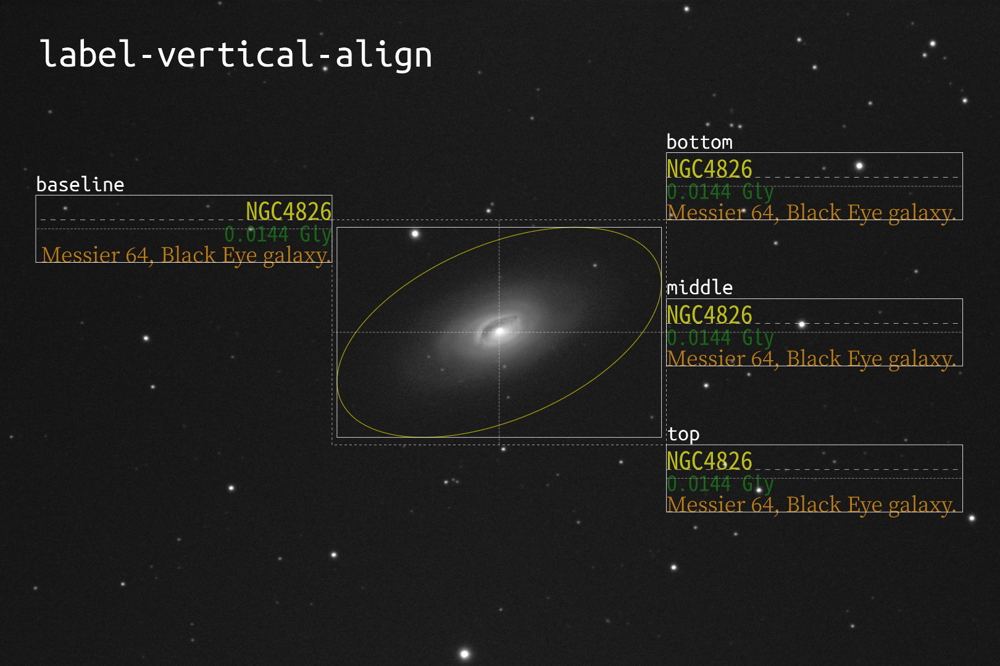

# ラベルのレイアウト

ラベルのレイアウトはスタイル設定ファイルの `marker` オブジェクトで設定します。関連する設定項目は `x-margin`, `y-margin`, `label-position`, `label-vertical-align` です。

## マーカー矩形、マージン矩形、ラベル矩形

ラベル(名前と説明文)のレイアウトはマーカーを囲む矩形を基準にして行われます。以下の図では、マーカー(天体を囲む黄色い楕円)に外接する矩形(マーカー矩形)を実線で、その外側にマージンを取った矩形(マージン矩形)を点線で示しています。

マージン矩形はマーカー矩形に横方向のマージン幅 `x-margin` と縦方向のマージン幅 `y-margin` (どちらもピクセル単位で指定)を加えたもので、この矩形を基準にしてラベルが配置されます。

上の図でラベル全体を囲む実線の矩形(ラベル矩形)は左辺がマージン矩形の右辺に接するように、またラベルの天体名(銀河データファイルの `name` で指定されたもの)の下の粗い点線で示されるベースラインの垂直位置がマージン矩形の上辺と一致するようにレイアウトされています。

※ ラベル矩形の座標と高さはベースライン位置とフォントサイズを元に計算しています。Galaxy Annotator 側からはフォントの文字(グリフ)の本当の大きさはわからないため、フォントによっては文字の一部が矩形をはみ出して描画されることがあります。

## ラベルの配置位置

ラベルの配置はマージン矩形のどの位置(頂点または辺の中央の点)を基準にするかを `label-position` で指定します。指定可能な値は以下の通りです(全て文字列型)。

- `top-right` : 右上の頂点 (デフォルト値)
- `top-middle` : 上辺の中央の点
- `top-left` : 左上の頂点
- `middle-right` : 右辺の中央の点
- `middle-middle` : 矩形の中心点 (天体に重なるので通常使いません)
- `middle-left` : 左辺の中央の点
- `bottom-right` : 右下の頂点
- `bottom-middle` : 下辺の中央の点
- `bottom-left` : 左下の頂点

`label-vertical-align` がデフォルト値(`auto`)の場合、それぞれ以下の図のようなレイアウトになります。

`label-position` に `top-right`, `middle-right`, `bottom-right` を指定した場合は、ラベル矩形は左辺がマージン矩形の右辺に接するように配置され、ラベルの文字列は左寄せになります。

`label-position` に `top-left`, `middle-left`, `bottom-left` を指定した場合は、ラベル矩形は右辺がマージン矩形の左辺に接するように配置され、ラベルの文字列は右寄せになります。

`label-position` に `top-middle`, `bottom-middle` を指定した場合はラベル矩形の垂直方向の中心線(図では縦の細かい点線)とマージン矩形の垂直方向の中心線(図では縦の細かい点線)が一致するように配置され、ラベルの文字列は中央寄せになります。

`top-middle`, `bottom-middle` でラベル矩形の垂直方向の配置が他と異なるのは `label-vertical-align` が `auto` になっていることによる効果で、天体にラベルが重ならないように配置されています。

## ラベルの垂直アライメント

`label-position` で指定されたマージン矩形上の基準点に対して、ラベル矩形のどの部分を合わせて垂直方向の位置合わせを行うかを `label-vertical-align` で指定できます。指定可能な値は以下の通りです(全て文字列型)。

- `auto` : 自動 (デフォルト値)
- `baseline` : 名前の行のベースライン
- `top` : ラベル矩形の上辺
- `middle` : ラベル矩形の水平方向の中心線
- `bottom` : ラベル矩形の下辺

それぞれ以下の図のようなレイアウトになります。

`label-vertical-align` に `auto` を指定した場合は、`label-position` が `top-middle` の場合は `bottom` に、`bottom-middle` の場合は `top` に、それ以外の場合は全て `baseline` として扱われます。